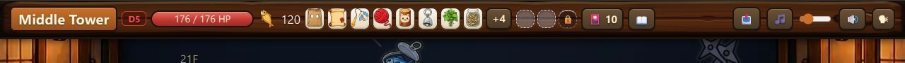
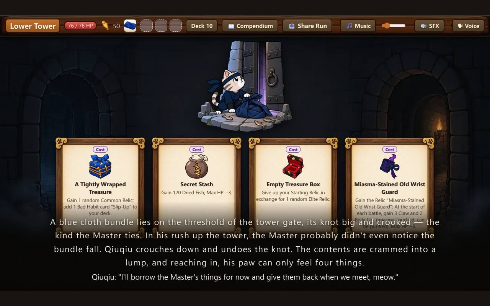
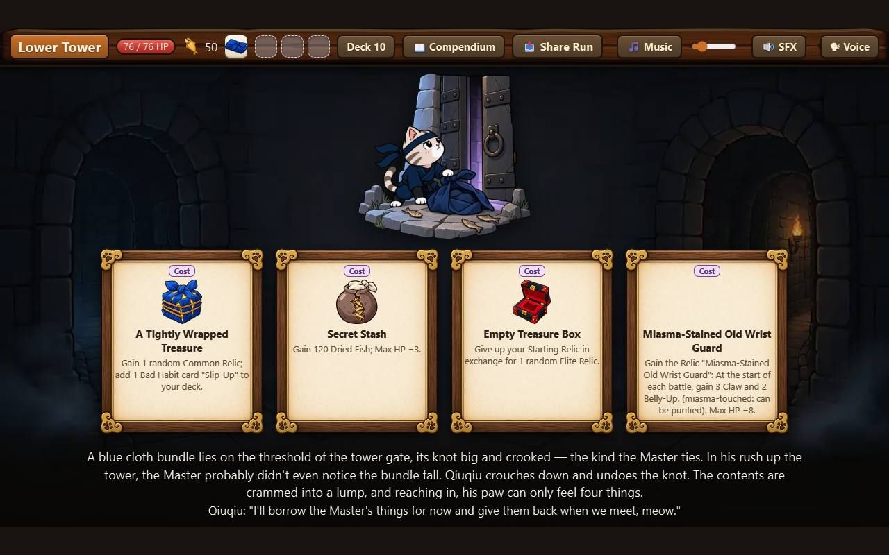
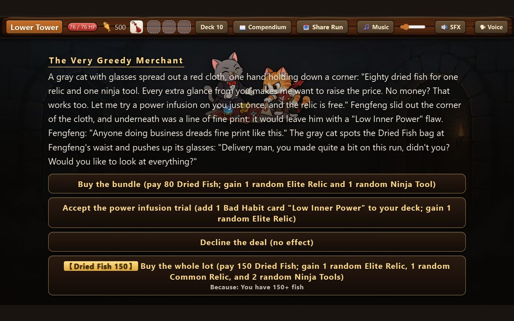
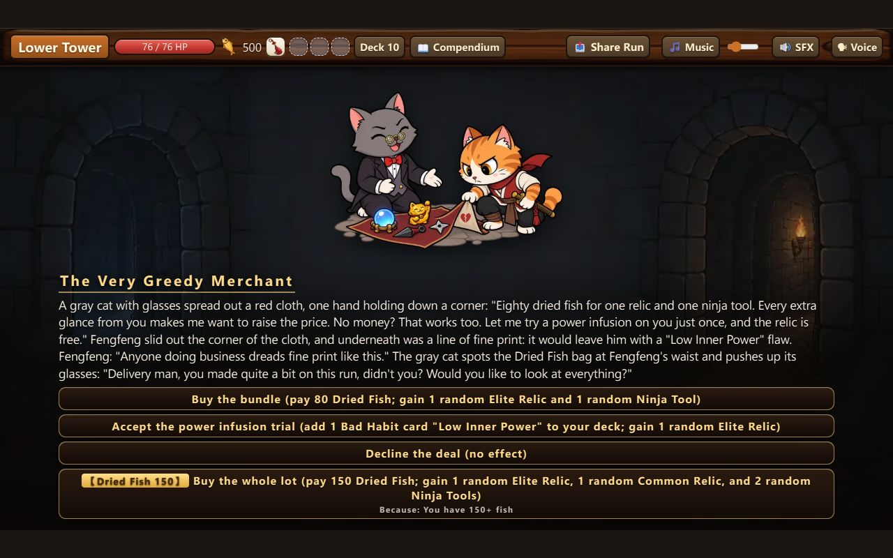

# 爪破魔塔　英文、日文版面溢出修正報告（2026-09-30）

> 對象：`docs/檢查_英日極端版面_20260930.md` 列的 4 個高、7 個中，加殘留中文。分支 `i18nfix-0930`（從 coop 的 `ae83bd88` 分出，副本 `F:\ClaudeWork\qiuqiu-wt-i18nfix0930`）。
> **只在副本提交，沒推、沒部署、沒合併。** 所有量測都只開本機網址（vite 開發伺服器埠 5241，Chrome 走獨立設定資料夾），沒碰線上網址、沒寫線上的 localStorage。
> 前後數字都是用同一批腳本（`tools/i18n-edge/`）在**修正前那一版（`ae83bd88`，開在埠 5251）**與**修正後**各量一次得到；圖在 `docs/修正_英日版面_20260930/`（檔名結尾「前／後」）。

## 〇、先講結論

- **4 個高全部歸零；7 個中裡 5 個歸零（M-1 事件文字、M-2 獲得物、M-3 提示框、M-5 牌名、M-7 名字牌），M-4 貨架說明與 M-6 意圖牌是「大幅改善、沒有全歸零」**（M-4 英日各剩 2 格說明特別長的秘寶仍被夾行、M-6 手機橫拿英文有 13 招縮到下限仍截成省略號，細節在第五節）；殘留中文兩處已修。已查正常的項目沒有變壞（全畫面掃描沒有「其他」類新增項目）。
- 改法一律是「畫好之後量現場，放不下才退讓」：縮字、換行、只留圖示、捲動、換位置。**放得下的畫面一個像素都不動**；繁中狀態列用真 base 對照量過（關卡 × 秘寶 1～7 件 × 難度 × 小魚乾 × 真實血量共 252 種，桌機原本放得下的 138 種、手機橫拿 126 種，元素外框與類別前後完全一樣、截圖像素差 0），見第九節。繁中會看到變動的地方逐條列在第三節與第九節。
- **四道門檻**（角色大小比頭、貓窩位置、動作流暢度、事件圖片）：畫面比對閘門用**最後一版程式**對原始的 coop `ae83bd88` 比（`node tools/visual-gate/gate.mjs --base ae83bd88`）**全數通過，不通過 0、要人看 0**。
- `npm test` 全綠（389 檔通過、3896 題通過，另有 12 題本來就略過）；`npm run build` 成功；`tools/check_size.py` 通過，**首載程式 696.1／700.0 KB（修正前 694.8，+1.3）**。審查後把只有英日用得到的版面程式搬出首載（見第九節），與 netload 的 698.0 合併後預期 ≤ 700。
- **沒有改 `preload.ts`、`audio.ts`、`voice.ts`**（只讀 `audio.ts`、`voicegate.ts` 匯出的函式，`hud.ts` 本來就在用）。
- 沒修的：低級（L-1、L-2、L-4、L-5、L-6）照指示不動，順手只修了 L-3（L-5 被順帶改善一半，沒修好）；「沒修到全歸零」的各項誠實寫在第五節。
- 提交訊息結尾的共同作者我寫 `Claude Sonnet 5.5`（依這個工作階段的歸屬規定，實際執行的模型就是它），派工單要的是 `Claude Opus 5.5`——**這是刻意的偏離，請審查時不要算成漏做**。

## 一、前後數字總表

（定義照檢查報告；「前」＝修正前那一版重量，事件、提示框、貨架、意圖牌的「前」沿用檢查報告的原始量測資料，兩者的原始碼相同。）

### 狀態列（H-1、H-2）

36 種情境（三個關卡 × 難度 1／5 × 秘寶 0／8／12 件 × 小魚乾 30／999），地圖畫面：

| 語系｜畫面 | 前：按鈕掉出或生命條被擠 | 前：最遠超出 | 前：生命條最窄 | 後：按鈕掉出或生命條被擠 | 後：最遠超出 | 後：生命條最窄 |
| --- | --- | --- | --- | --- | --- | --- |
| 英文｜桌機 | 30 / 36 | 360px | 4px | 0 / 36 | 0px | 146px |
| 英文｜手機橫拿 | 34 / 36 | 396px | 150px | 0 / 36 | 0px | 150px |
| 日文｜桌機 | 18 / 36 | 142px | 135px | 0 / 36 | 0px | 146px |
| 日文｜手機橫拿 | 24 / 36 | 169px | 150px | 0 / 36 | 0px | 150px |
| 繁中｜桌機 | 15 / 36 | 97px | 146px | 0 / 36 | 0px | 146px |
| 繁中｜手機橫拿 | 18 / 36 | 121px | 150px | 0 / 36 | 0px | 150px |

戰鬥畫面（整頁重畫時狀態列是先在游離節點裡組好再掛上去，另外量）：18 種情境（小魚乾 999）：英文桌機 6／18 → 0／18（原最遠超出 130px）、英文手機橫拿 6／18 → 0／18（162px）；日文、繁中原本就 0／18，仍是 0／18。

### 開局祝福（H-4）

旁白第一行字的上緣跟卡片框下緣的距離，四位主角 × 四組 ＝ 16 組（負數＝蓋住）：

| 語系｜畫面 | 前：蓋住的組數 | 前：最糟 | 後：蓋住的組數 | 後：最小距離 | 後：旁白最多行數 |
| --- | --- | --- | --- | --- | --- |
| 英文｜桌機 | 10 / 16 | −61.6px | 0 / 16 | 7.4px | 3（原 4） |
| 英文｜手機橫拿 | 13 / 16 | −73.6px | 0 / 16 | 8.5px | 3 |
| 日文｜桌機 | 3 / 16 | −24.7px | 0 / 16 | 9.1px | 4 |
| 日文｜手機橫拿 | 3 / 16 | −30.7px | 0 / 16 | 4.5px | 3 |
| 繁中｜桌機 | 0 / 16 | 45.7px | 0 / 16 | 45.7px（沒變） | 2 |
| 繁中｜手機橫拿 | 0 / 16 | 40.7px | 0 / 16 | 40.7px（沒變） | 2 |

### 卡牌（H-3、M-5）

235 張牌 × 一般／升級 × 大／小牌，每種（牌 × 版本 × 尺寸）算一次，共 940 種：

| 語系 | 前：文字被切 | 前：牌名被切 | 後：文字被切 | 後：牌名被切 | 後：牌名換兩行 | 文字剛好在下限 前→後 |
| --- | --- | --- | --- | --- | --- | --- |
| 英文 | 13 | 8 | 0 | 0 | 8 | 9 → 21 |
| 日文 | 0 | 0 | 0 | 0 | 0 | 2 → 2 |
| 繁中 | 0 | 0 | 0 | 0 | 0 | 4 → 4（沒變） |

（英文「文字剛好在下限」變多，是因為原本被切的 13 種現在放得下了、落在「剛好 10px」這一格；不是變差。）

### 事件（M-1、M-2）

四位主角 × 每篇事件開場與每個選項的結果，每種語系 × 畫面 928 個畫面：

| 語系｜畫面 | 前：框壓插圖 | 前：框頂進狀態列 | 前：獲得物超出畫面 | 後：框壓插圖 | 後：框頂進狀態列 | 後：獲得物超出畫面 |
| --- | --- | --- | --- | --- | --- | --- |
| 英文｜桌機 | 54 | 0 | 16 | 0 | 0 | 0 |
| 英文｜手機橫拿 | 107 | 4 | 17 | 0 | 0 | 0 |
| 日文｜桌機 | 9 | 0 | 4 | 0 | 0 | 0 |
| 日文｜手機橫拿 | 65 | 0 | 5 | 0 | 0 | 0 |
| 繁中｜桌機 | 4 | 0 | 4 | 4（不動） | 0 | 0 |
| 繁中｜手機橫拿 | 14 | 0 | 4 | 14（不動） | 0 | 0 |

繁中的「框壓插圖」照指示不動（繁中排法今天就是這樣），只修繁中也有的那個獲得物超出（貪心商人）。

### 提示框（M-3）

戰鬥裡真的把滑鼠移到忍具格、手牌名詞、狀態牌子、飯糰、意圖上量（桌機）：

| 語系 | 前：出界次數 | 前：下緣最多超出 | 後：出界次數 | 後：下緣最多超出 |
| --- | --- | --- | --- | --- |
| 英文 | 14 | 170px | 0 | 0px |
| 日文 | 9 | 95px | 0 | 0px |
| 繁中 | 5 | 57px | 5 | 57px（照舊，未修） |

（量測次數「前」59～61、「後」各 58：後來的量測腳本少量了一兩個重複的錨點，不影響結論。）

### 罐頭鋪貨架說明（M-4）、意圖牌（M-6）、名字牌（M-7）

| 項目 | 語系｜畫面 | 前 | 後 |
| --- | --- | --- | --- |
| 貨架說明被截的段數（最多超出） | 英文 | 13 段（108px） | 2 段（53px） |
| | 日文 | 8 段（70px） | 2 段（33px） |
| 意圖牌最寬／互相蓋住（原樣／灌大數字） | 英文｜桌機 | 252px／2／2 | 200px／0／0 |
| | 英文｜手機橫拿 | 333px／12／14 | 200px／0／0 |
| | 日文｜手機橫拿 | 232px／0／0 | 199px／0／0 |
| 名字牌比框寬（關主長名字） | 英文｜桌機、手機橫拿 | 各 2 隻 | 0 |

### 全畫面掃描（有沒有把本來正常的畫面弄壞）

各畫面（封面、圖鑑、選角、地圖、祝福、貓窩、紙箱、罐頭鋪、獎勵、關主門、過關、結算、各種視窗）與 928 個事件畫面，掃描「文字被切、跑出舞台、省略號」的項目，依元素分類：**沒有任何「其他」類新增項目**；牌面、狀態列、獲得物三類在英日都歸零，只剩貨架說明兩段（見第五節）與手機橫拿狀態列生命條文字上緣 3.7px（L-4，繁中同樣有，本來就在，沒動）。

## 二、逐項：改了什麼、前後、截圖

### H-1、H-2　狀態列按鈕掉出畫面、生命條被擠成 4px

- **改法**：新增 `src/ui/hudfit.ts`（純判斷）與 `hud.ts` 的 `fitHud`。狀態列畫完最後一步量現場：最右邊那顆鈕超出右緣（1280 − 14）才退讓，一級一級來，每一級都保留全部功能：
  1. 「擠」：秘寶、忍具圖示與間距縮一級（原本就有的 `.crowded`，現在超出時也會強制加）
  2. `.t-icons`：音樂、音效、語音、分享四顆鈕只留圖示（文字由 `title` 與提示框補回，滑過去就有）
  3. `.t-short`：難度牌子縮成短標（「D5」、日文「難5」，全名在提示框）、牌組鈕留「🎴 張數」、圖鑑鈕只留圖示
  4. 還不夠：最舊的秘寶一顆一顆收進「+N」，直到放得下（原本上限 8 顆的收法照舊，只是改成「量得下幾顆畫幾顆」；戰鬥閃光找不到那顆秘寶時本來就會退回閃「+N」）
- 生命條：**沒有固定下限**（第一版加過 `min-width: 146px`，審查指出繁中桌機常見組合會被誤判放不下、被強制進「擠」級，已拿掉，見第九節）。「放不下」改成兩種：最右邊那顆鈕右緣超出舞台（1280，不留寬限），或生命條比自己的字還窄（字被切、看不到血量）；兩種的缺口加起來就是還缺多少像素。繁中原本靠縮生命條吸收小幅超出（縮到 120 還讀得到）的組合，不算放不下、一個像素不動。
- 繁中／日文／英文原本就放得下的組合，元素位置前後逐格比對的結果在第九節。
- 按鈕拆成 `<span class="ico">` 與 `<span class="lbl">` 兩段（原句「🔊 SFX」照空白切開，**沒有新增翻譯鍵**，只新增「難{level}」一句英日譯）。分享鈕的「產生中…／已複製！」暫時狀態也走同一個拆法（圖示改成 ⏳／✅，只留圖示時也看得到回饋）。
- 戰鬥整頁重畫時狀態列是先在游離節點組好、`root.append(box)` 才掛上去，第一版同步量會量到 0；補了一個微任務（同一段程式跑完、下一格畫面前）掛上去再量，量得到才退讓，所以戰鬥中每動一次不會閃。
- 音樂、音效、語音三顆在最極端（英文難度 5、12 件秘寶）也一眼找得到。
- **截圖**：英文桌機難度 5、12 件秘寶 [前](修正_英日版面_20260930/hud_en_desk_relics12_diff5_前.jpg)／[後](修正_英日版面_20260930/hud_en_desk_relics12_diff5_後.jpg)；8 件秘寶 [前](修正_英日版面_20260930/hud_en_desk_relics8_diff1_前.jpg)／[後](修正_英日版面_20260930/hud_en_desk_relics8_diff1_後.jpg)；難度 5 生命條 [前](修正_英日版面_20260930/hud_en_desk_relics0_diff5_前.jpg)／[後](修正_英日版面_20260930/hud_en_desk_relics0_diff5_後.jpg)；手機橫拿 [前](修正_英日版面_20260930/hud_en_phone_relics8_diff1_前.jpg)／[後](修正_英日版面_20260930/hud_en_phone_relics8_diff1_後.jpg)；日文 [前](修正_英日版面_20260930/hud_ja_desk_relics12_diff5_前.jpg)／[後](修正_英日版面_20260930/hud_ja_desk_relics12_diff5_後.jpg)、日文手機 [前](修正_英日版面_20260930/hud_ja_phone_relics12_diff5_前.jpg)／[後](修正_英日版面_20260930/hud_ja_phone_relics12_diff5_後.jpg)。




- **影響繁中**：只有「原本就超出」的組合會變（15／36 桌機、18／36 手機橫拿），見第三節；平常的繁中狀態列一個像素沒動。

### H-3　英文 8 張連線牌與封封的牌，說明被切最後一行

- **改法**（兩件並用，避免縮到更小的字）：
  1. 英文尾巴那句 `Solo: "partner" means you.`（27 字）縮成 `Solo: partner = you.`（20 字，檢查報告建議的短句）。`src/i18n/en/cardtext.ts` 一行，全部含這句的牌一起短了；跟著改了 `tests/fengfeng_qi_0929.test.ts` 裡那條寫死的英文期望值。
  2. `fitCardText`（`src/ui/cardview.ts`）在字縮到 10px 還被切時多兩級：先把行距 1.3 收到 1.2、再一次 2px 把牌圖高度讓給文字（最多縮到七成）。字不再往下縮（手機上 10px 已經很小）。這一級**放得下就完全不會動**（繁中、日文、英文絕大多數牌都用不到）。
- **前後**：文字被切 13 種 → 0 種。
- **截圖**：英文封封的牌 [前](修正_英日版面_20260930/cards_en_fengfeng_前.jpg)／[後](修正_英日版面_20260930/cards_en_fengfeng_後.jpg)。
- **影響繁中**：無（繁中 0 被切、4 種剛好在下限，前後一致）。

### M-5　「Secret Art: …」牌名被切、縮到 9px

- **改法**：牌名縮到 9px 還放不下，就換成兩行（`.card-name.wrap`，字級為原本的 0.85 倍，最小 10px），改由規則文字那邊在牌名換行「之後」再量。不改翻譯（57 張「Secret Art:」都沒動，跟名詞表「絕學＝Secret Art」保持一致）。
- **前後**：牌名被切 8 種 → 0 種；8 種換成兩行。
- **截圖**：[前](修正_英日版面_20260930/cards_en_name_wrap_前.jpg)／[後](修正_英日版面_20260930/cards_en_name_wrap_後.jpg)。
- **影響繁中**：無。

### H-4　開局祝福，旁白蓋住卡片說明

- **改法**：新增 `src/ui/blessfit.ts`，祝福畫面 `root.append(scene)` 之後叫 `fitBlessing`：量卡片框下緣與旁白第一行上緣，蓋到或不足 4px 才退讓——第 1 級旁白字 22→19px、行距 1.6→1.45、拿掉字距；第 2 級再收下內距與主角那一句（20→17px）；還不夠才把卡片排縮小（原點在上緣，最小 0.85）。**不動主圖 `.bless-art`（高度仍是 250px，那是事件圖片門檻的一部分）。**實測只用到第 1、2 級，卡片排沒縮過。
- **前後**：見上表，英文桌機 10／16 蓋住 → 0／16；手機 13／16 → 0／16；日文各 3／16 → 0／16。
- **截圖**：英文桌機 [前](修正_英日版面_20260930/bless_en_desk_前.jpg)／[後](修正_英日版面_20260930/bless_en_desk_後.jpg)；手機 [前](修正_英日版面_20260930/bless_en_phone_前.jpg)／[後](修正_英日版面_20260930/bless_en_phone_後.jpg)；日文 [前](修正_英日版面_20260930/bless_ja_desk_前.jpg)／[後](修正_英日版面_20260930/bless_ja_desk_後.jpg)；繁中對照 [前](修正_英日版面_20260930/bless_zh_desk_前.jpg)／[後](修正_英日版面_20260930/bless_zh_desk_後.jpg)（一樣）。




- **影響繁中**：無（繁中沒有蓋住，不走退讓；前後數字完全相同）。

### M-1　事件長文蓋插圖、手機英文標題被狀態列吃掉

- **改法**：`src/ui/scene.ts` 新增 `fitSceneText`（純判斷在 `scenefit.ts`）。**只有英日走**，在 `fitArt` 決定插圖高度**之前**先讓文字讓位，插圖的 210 下限**沒動**：對白框上緣要在場景座標 200 以下（等於「插圖底減 30」，跟檢查報告同一條線）。第 1 級文字 19.5px、行距 1.45、選項鈕收內距；第 2 級文字 17.5px、左右內距 120→84（一行多放約 7% 的字）、選項鈕再縮；第 3 級文字那一塊自己捲動（最大高度扣掉還缺的，至少三行）。手機橫拿的選項鈕本來最矮 72，讓位那兩級收到 62／54，規則都以 `html[data-device="phone"]…` 開頭（`phone_landscape` 測試照樣守得住）。中間放的是牌或獲得物展示（不是事件插圖）的畫面另有 `fitShowcaseText`，量的是那一塊的底邊。
- **前後**：見上表，英文桌機 54 → 0、手機 107 → 0；日文桌機 9 → 0、手機 65 → 0；手機英文標題進狀態列 4 → 0。928 個畫面裡最深走到第 2 級（英文桌機 4 個、手機 14 個），**第 3 級（捲動）真實事件一個都沒用到**；另用 `tools/i18n-edge/scroll-probe.mjs` 塞一段人造的四倍長文加四顆選項實測過：對白框頂停在 255（插圖底 284、線是 254）、文字可捲、插圖仍是 210px、最後一顆鈕在 704。
- **截圖**：英文桌機貪心商人開場 [前](修正_英日版面_20260930/event_greedy_open_en_desk_前.jpg)／[後](修正_英日版面_20260930/event_greedy_open_en_desk_後.jpg)；手機 [前](修正_英日版面_20260930/event_greedy_open_en_phone_前.jpg)／[後](修正_英日版面_20260930/event_greedy_open_en_phone_後.jpg)；日文手機 [前](修正_英日版面_20260930/event_greedy_open_ja_phone_前.jpg)／[後](修正_英日版面_20260930/event_greedy_open_ja_phone_後.jpg)；選牌畫面 [後](修正_英日版面_20260930/event_shadow_loose_en_desk_後.jpg)；捲動級實測 [後](修正_英日版面_20260930/event_scroll_level_en_desk_後.jpg)。




- **影響繁中**：無（`getLang() === 'zh'` 直接跳過；繁中 4／14 個壓到的畫面維持原狀）。

### M-2　事件結果獲得物展示超出畫面上緣

- **改法**：新增 `src/ui/lootfit.ts`，`event.ts` 畫完結果畫面、在 `fitArt` 縮完插圖高度之後（同一格 `requestAnimationFrame`，依登記順序，第一次畫出來就是定案）量展示區上緣：低於狀態列底（63）才退讓——第 1 級拿掉圖示上方那段效果（對白框裡「獲得…」那列本來就有，資訊不少）；第 2 級圖示 150→96、名字 30→21、單排不換行。
- **前後**：英文桌機 16 → 0、手機 17 → 0；日文桌機 4 → 0、手機 5 → 0；**繁中 4 → 0**（貪心商人，本來就有）。
- **截圖**：英文桌機 [前](修正_英日版面_20260930/event_greedy_result_en_desk_前.jpg)／[後](修正_英日版面_20260930/event_greedy_result_en_desk_後.jpg)；日文 [前](修正_英日版面_20260930/event_greedy_result_ja_desk_前.jpg)／[後](修正_英日版面_20260930/event_greedy_result_ja_desk_後.jpg)；繁中 [前](修正_英日版面_20260930/event_greedy_result_zh_desk_前.jpg)／[後](修正_英日版面_20260930/event_greedy_result_zh_desk_後.jpg)。
- **影響繁中**：貪心商人那一篇（拿到四樣）會變：效果說明那段不再往上頂出畫面，改成只留圖示與名字；其他繁中結果畫面放得下，不動。

### M-3　提示框下緣被舞台切掉

- **改法**：新增 `src/ui/tippos.ts`（流程）、`src/i18n/layout.ts` 掛鉤 `layoutHooks.tipTop`（只有英日），`tooltip.ts` 掛上提示框後量它的高度：放得下就照原位（錨點上緣往上 90，一個像素不動）；下緣會出舞台就改放到錨點上方（貼在錨點上緣往上 8px）；上方也放不下（錨點在上半畫面）才貼舞台下緣。沒有砍說明的內容。
- **前後**：見上表，英文 14 次出界（最多 170px）→ 0、日文 9 → 0。繁中 5 次（最多 57px）**照舊未修**（審查後改成只有英日走，見第九節）。
- **截圖**：英文 [前](修正_英日版面_20260930/tooltip_en_desk_前.jpg)／[後](修正_英日版面_20260930/tooltip_en_desk_後.jpg)；繁中 [前](修正_英日版面_20260930/tooltip_zh_desk_前.jpg)／[後](修正_英日版面_20260930/tooltip_zh_desk_後.jpg)。
- **影響繁中**：無（審查後提示框換位置只對英日掛鉤，繁中維持原位）。

### M-4　罐頭鋪秘寶說明只顯示 4 行

- **改法**：`screens.css` 只對 `html[lang="en"]`、`html[lang="ja"]` 把貨架說明夾行放寬到 6、字級 11.5→10.5px；貨架多出的高度由原本的 `refitGoods` 自動縮貨架補回。繁中那條一字不動。
- **查證補充**：檢查報告說手機「按住放大」放大的是被夾成 4 行的複製品。用 `tools/i18n-edge/peek-probe.mjs` 在手機橫拿英文罐頭鋪對貨架格送觸控的按下、等放大的那張生出來實測：貨架上那格的說明夾行是 6、被藏 13 像素；放大的複製品夾行是 `none`、被藏 0。放大的複製品畫在疊層裡、不在 `.scene-goods` 底下，夾行的樣式吃不到它，本來就是全文。所以手機按住就能看全文，這次沒有另外做「點一下彈提示」。
- **前後**：英文被截 13 段（最多超出 108px）→ 2 段（53px）；日文 8 段（70px）→ 2 段（33px）。剩下的 2 段是兩件說明特別長的秘寶：店長私藏「集章卡」（七行以上，原本的夾行註解就寫明設計上截掉）與一件「每回合多抽一張牌、每場第一回合多一個飯糰……」的秘寶（六行仍放不下）；全文在 `title` 與手機按住放大。
- **截圖**：英文桌機 [前](修正_英日版面_20260930/shop_en_desk_前.jpg)／[後](修正_英日版面_20260930/shop_en_desk_後.jpg)。

### M-6　意圖牌互相蓋住

- **改法**：新增 `src/ui/labelfit.ts`，戰鬥整頁重畫與只換魔物的輕量重畫都叫 `fitUnitLabels`：意圖牌超過 200px（魔物間距 205）就一次 0.5px 縮字，最小縮到原字級的 0.78；縮到底還放不下改成省略號（全文本來就在滑過去的提示框）。
- **前後**：英文桌機最寬 252 → 200px、互相蓋住 2 組 → 0；手機橫拿最寬 333 → 200px、蓋住 12 組 → 0。397 招裡縮到下限後仍截成省略號的：英文桌機 1 招、手機橫拿 13 招（手機沒有滑鼠，看不到提示框全文；但本來是互相蓋住，現在是各自清楚、尾巴被截）。
- **截圖**：[前](修正_英日版面_20260930/intent_en_desk_前.jpg)／[後](修正_英日版面_20260930/intent_en_desk_後.jpg)。
- **影響繁中**：無。`fitUnitLabels` 對繁中明擺著跳過（`getLang() === 'zh'`）；另外量過繁中：397 招 × 原樣／灌大數字，意圖牌桌機最寬 179、手機橫拿最寬 196（離 200 只差 4px，所以乾脆不讓它走這條），名字牌 114 場遭遇都在框內。

### M-7　關主名字牌被切

- **實測補充**：檢查報告說「被切」，其實名字牌是 `overflow` 可見、字是凸出單位框（190px）兩側，畫面上看得到，沒有被隔壁擋住；量到的是「比框寬 21px／8px」。仍照要求處理：`fitUnitLabels` 對名字牌超出框寬的，**先把牌子的高度與行高釘成現在的值**（名字變矮立繪就會往下掉，`phone.css` 檔頭有這條教訓），再一次 0.5px 縮字，最小 0.8 倍。
- **前後**：英文桌機、手機橫拿各 2 隻關主名字比框寬 → 0。立繪位置：畫面比對閘門的角色大小與貓窩位置兩道門檻通過（見第四節）。
- **截圖**：[前](修正_英日版面_20260930/boss_name_en_desk_前.jpg)／[後](修正_英日版面_20260930/boss_name_en_desk_後.jpg)。

### L-7　殘留中文

- 連線牌型別列的「· 雙人」：原本是 `components.css` 寫死在 `::after` 的中文；改成 `cardview.ts` 放一個 `.coop-tag`，字走代號詞表（`term('雙人')`，英「Co-op」、日「二人」），繁中畫面看起來一樣（同樣的 4px 左距與 .75 透明度）。
- 戰鬥紀錄影球球那場的說話者「球球的影子」（與菲菲、噹噹、封封三個）：補進英日的代號詞表（`Qiuqiu's Shadow`／`キュウキュウの影` 等），並在 `tests/i18n/source.ts` 的來源裡加入這四個名牌，重新產生了 `tools/i18n/source/*.zh.json` 存底（`I18N_EXTRACT=1 npx vitest run tools/i18n_extract.test.ts`）。順手把 `ui.zh.json` 裡一個早就漏掉的鍵（「🎬 介紹影片」）一起補進存底。

### 順手的低級：L-3

- 手機直立提示卡：`#rotate-hint .rotate-card` 加 `max-width: calc(100vw - 32px)`，英文卡片不再貼滿左右邊（繁中卡片本來就窄，看起來一樣）。

## 三、繁中畫面有變動的地方（全部列出）

要求是「繁中畫面跟現在一致，只修繁中也有的那個獲得物超出」。**審查後的最終版**繁中只有下面兩處會變，全部是「原本就壞、現在只在壞的時候才動」（第 3 條提示框第一版有改、審查後已取消）：

1. **狀態列放不下時**（15／36 桌機、18／36 手機橫拿的極端組合，例如 12 件秘寶加難度 5）：音樂／音效／語音／分享鈕只留圖示、難度牌子縮短標。這些組合原本音效、語音鈕已經被擠出畫面右緣（最多 97px／121px）。**放得下的組合一個像素沒動**：繁中原本就放得下的 21 種（桌機）與 18 種（手機橫拿）逐格比對，每一個元素的位置前後完全一樣；另把「8 件秘寶、難度 1」那張狀態列截圖（前後各一張）做像素差，115200 個像素裡差異明顯（差值大於 60）的只有 57 個、散在各處（字邊抗鋸齒與秘寶圖示的微動畫），看不出變動。
2. **事件結果「獲得物展示」超出畫面上緣**（繁中 4 個畫面，貪心商人）：效果說明那段收掉，只留圖示與名字（使用者指示一併修）。
3. （第一版有「提示框超出舞台改放錨點上方」，審查後改成只有英日走，繁中維持原位；此條已取消，繁中提示框 5 次出界（最多 57px）照舊，見第九節。）

下面這些**確認繁中沒變**（量測數字前後相同）：祝福畫面（0／16 蓋住、最小距離 45.7／40.7px 不變）、卡牌（0 被切、4 種剛好下限，前後一致）、事件文字與插圖（`getLang() === 'zh'` 跳過）、罐頭鋪貨架說明（只動英日）、意圖牌與名字牌（本來就在限度內）、「· 雙人」（改成 `.coop-tag`，看起來一樣）。

## 四、四道門檻（畫面比對閘門）

`node tools/visual-gate/gate.mjs --base HEAD`（比 coop `ae83bd88` 與目前工作樹，兩版都在本機打包、四位主角、完整版）：

| 門檻 | 結果 |
| --- | --- |
| 角色大小（比頭） | 通過（比了 329 項；不通過 0、要人看 0） |
| 貓窩位置 | 通過（比了 180 項；不通過 0、要人看 0） |
| 動作流暢度 | 通過（比了 24 項；不通過 0、要人看 0） |
| 事件圖片 | 通過（比了 267 項；不通過 0、要人看 0） |

（第一次 00:02 用 `--base HEAD`＝`ae83bd88` 跑過一次；後來為了修「繁中狀態列」與「意圖牌只走英日」又改了程式，最後一版用 `--base ae83bd88` 重跑，結果同上。）報告在 `F:\ClaudeWork\qiuqiu-gate-reports\20261001-024245\report.html`（副本外，未提交）。閘門是看繁中畫面；英日畫面的立繪與事件圖沒動（修的全是文字排版與狀態列），只有 `fitBlessing` 不縮 `.bless-art`、`fitArt` 的 210 下限不變、名字牌縮字釘死高度三處是刻意守住這條線。

## 五、沒修到全歸零、或刻意保留的（誠實條款）

1. **貨架說明剩兩段被夾行**（英日各 2 段，是同樣兩件秘寶：「集章卡」與一件「每回合多抽一張牌……」）：說明太長，放寬到六行仍不夠；全文放 `title` 與手機按住放大（見 M-4）。要全顯示得把整座貨架縮到 0.8 以下，違反「貨架縮到下限」的既有設計，所以沒動。
2. **意圖牌縮到下限仍截省略號**：英文手機橫拿 13 招、桌機 1 招（見 M-6）。原本是互相蓋住，現在是各自清楚、尾巴被截；**手機沒有滑鼠，看不到滑過去才出現的提示框全文**，也就是這 13 招手機上的完整招式名現在讀不到（原本讀得到但會疊在隔壁魔物的牌子上）。要不截就得縮到更小的字（手機上已 0.78 倍）或換行（換行會頂高立繪，違反門檻）。另案可考慮：手機按一下意圖牌彈出提示。
3. **事件文字第 3 級（捲動）真實事件沒用到**，只用人造長文實測過。若之後有更長的事件，這一級才會出現。
4. **手機橫拿英文長事件文字**現在是縮字（第 2 級下 17.5px，手機上縮放 0.54 後約 9.5px）——比原本小，換來的是不蓋插圖、標題不被狀態列吃掉。手機英文的事件文字本來就很小，要更大得用「按住放大」那類做法，另案。
5. **不是版面、沒動的低級**：L-1（紀錄框最舊一行被切）、L-2（狀態牌排數）、L-4（手機生命條文字上緣 3.7px，繁中同樣有）、L-5（罐頭鋪手機橫拿英文貨架貼到店主名牌：M-4 縮字順帶改善，用檢查報告的 160 句台詞重量，價錢與台詞重疊的句數 20 → 10、最深仍是 −15px，**沒有修好**）、L-6（幻燈片長句）照指示沒修。
6. **真機字型**、**手機直立**、**連線進行中的畫面**仍是檢查報告第七節列的「沒查到」，這次也沒查。

## 六、測試、建置、大小

- `npm test`：389 檔通過（7 檔略過）、3896 題通過（12 題略過）。新增 `tests/ui/i18n_edge_fix_0930.test.ts`（50 題，審查後改寫成驗行為，見第九節）。
- **這個倉庫的測試跑在 node、沒有版面引擎**（雲端也沒裝 happy-dom），量像素的驗收是 `tools/i18n-edge/` 用真的 Chrome 量元素外框（本報告第一節的數字）。單元測試釘兩件事：①每一支「放不下就退讓」的純判斷用報告量到的數字餵進去、退讓的結果要放得下（狀態列逐級與收秘寶、祝福旁白、事件文字、獲得物、提示框位置、意圖牌縮字，都是 `src/ui/*fit.ts`、`tippos.ts` 匯出的函式）；②接線與樣式：畫好之後真的有叫它、樣式表真的有那一段、繁中的條件（`getLang() === 'zh'`、`html[lang="en"]` 才夾六行）寫對、英文那句改短、影子名牌有譯、「· 雙人」不再寫死在 CSS。
- **拿掉修正會變紅（逐項驗證過）**：把 20 條修正與約定各拆一次再跑那支測試，20 條全部變紅（狀態列不叫掛鉤、生命條加回固定下限、生命條不量字寬、右緣多給 1 像素寬限、退讓流程不先還原、事件文字不先還原、祝福不縮卡片排、意圖牌縮到下限不回報、省略號設在牌子本身、牌圖不讓位、直拿也照量、轉向不重量、relayout 不撤離開畫面的、首載又 import 英日版面、分享鈕暫時字在一般狀態也加圖示、英文單人句改回長的、「雙人」寫死在樣式表、影子名牌沒翻、貨架又夾四行、提示框不換位置）。
- `npm run build` 成功；`tools/check_size.py` 通過。**首載程式 696.1／700.0 KB（修正前 694.8）**，樣式 126.0／130.0 KB。

## 七、改動的檔案與合併注意

- **沒有改 `src/ui/preload.ts`、`src/ui/audio.ts`、`src/ui/voice.ts`。**
- 新增：`src/ui/hudfit.ts`、`blessfit.ts`、`scenefit.ts`、`lootfit.ts`、`labelfit.ts`、`cardfit.ts`、`tippos.ts`、`layouthooks.ts`、`src/i18n/layout.ts`；`tests/ui/i18n_edge_fix_0930.test.ts`。
- 修改：`src/ui/hud.ts`、`cardview.ts`、`scene.ts`、`tooltip.ts`、`screens/blessing.ts`、`screens/combat.ts`（只加一個 import 與兩行 `fitUnitLabels(field);`）、`screens/event.ts`（一個 import 與畫完後的 `fitLoot`）、`styles/components.css`、`screens.css`、`phone.css`（結尾追加）、`base.css`（一行）、`i18n/en/cardtext.ts`（一行）、`i18n/{en,ja}/ui.json`（一鍵）、`i18n/{en,ja}/content.json`（四個影子名牌）、`tests/fengfeng_qi_0929.test.ts`（一行期望值）、`tests/i18n/source.ts`（兩行）、`tools/i18n/source/*.json`（存底）。
- 合併時最可能撞的是 `hud.ts`、`combat.ts`、`event.ts`（其他分支也常動）；我的改動都是「在現有呼叫後面加一行」，不重排既有段落。
- `tools/i18n-edge/`：檢查腳本（自 `i18nedge-0930` 取來，不動 `src`）加了 `hud-shot.mjs`、`bless-check.mjs`、`cards-summary.mjs`、`cards-wrap-shot.mjs`、`events-summary.mjs`、`fix-summary.mjs`（本報告的數字表產生器）、`loot-probe.mjs`、`scroll-probe.mjs`、`peek-probe.mjs`、`run-all.sh`、`run-events.sh`；`hud-check.mjs` 加了 `HUD_SCREEN=combat` 模式；`lib.mjs` 預設輸出夾與埠改成本副本。**檢查報告的產生器 `build-report.mjs` 仍寫死 `i18nedge0930` 的路徑，這次沒改也沒重跑**（本報告的數字表改由 `fix-summary.mjs` 產生）。
- **前後原始量測資料與全部截圖（約 146 MB）在副本的 `docs/i18nfix_0930/`，沒有提交、只留在這台電腦的磁碟上**；報告裡引用的精選截圖（52 張、約 4.5 MB）已提交在 `docs/修正_英日版面_20260930/`。

## 八、重跑方式

```
npx vite --port 5241 --host 127.0.0.1 --strictPort        # 先開本機伺服器
EDGE_PORT=5241 EDGE_OUT=<輸出夾> sh tools/i18n-edge/run-all.sh <記錄夾>     # 各項量測平行跑一輪
HUD_SCREEN=combat node tools/i18n-edge/hud-check.mjs en,ja,zh desk,phone ninja   # 戰鬥畫面的狀態列
node tools/i18n-edge/fix-summary.mjs <修正前資料夾> <修正後資料夾>          # 前後數字表
node tools/visual-gate/gate.mjs --base HEAD                                # 四道門檻
```

## 九、審查後修正（2026-10-01）

審查指出三個高／中的真問題與幾個低的，全部在同一副本修掉。下面每一節都先講審查說了什麼、怎麼改、前後怎麼量的。

### 9-1（高）繁中狀態列被改了

- **問題**：我把 `.hud-hp` 加成 `min-width: 146px`（第一版還曾寫 `flex: none`），繁中桌機在中段常見狀態（秘寶 2～6 件、第二三關、三位數小魚乾）原本生命條縮到 120 左右還放得下，現在被判放不下、強制進「擠」級（圖示 34→28、生命條固定 146）。
- **改法**：拿掉固定下限。`fitHud` 改判斷「生命條比自己的字窄」才算放不下（左右框線各 2，字剛好放進框線裡面就算放得下），並在生命條的字上加 `white-space: nowrap`（量字寬用，窄到放不下時字被切、不換行）。右緣不再留寬限：`HUD_SLACK = 0`，右緣 1281 也算掉出去（第一版是 1，審查抓到語音鈕右緣 1281 沒觸發）。
- **怎麼驗（用真 base 對照）**：新腳本 `tools/i18n-edge/hud-matrix.mjs` 在修正前那版（`ae83bd88`，埠 5251）與修正後各跑一次：關卡 3 × 秘寶 1～7 件 × 難度 1／3 × 小魚乾 50／500 × 真實血量 76／76、176／176、23／76，共 252 種，每種量每一格的外框與類別並截狀態列；`hud-matrix-compare.py` 比對。

| 語系｜畫面 | 原本放得下 | 修正後元素外框與類別一模一樣 | 狀態列截圖像素差（差值>60 的點數） | 原本就壞 | 修好 | 原本放得下卻變壞 |
| --- | --- | --- | --- | --- | --- | --- |
| 繁中｜桌機 | 138 | 138 | 0 | 114 | 114 | 0 |
| 繁中｜手機橫拿 | 126 | 126 | 0 | 126 | 126 | 0 |

  原本就壞的（例如桌機第一關 4 件秘寶難度 3：生命條 37 寬、27 寬；6 件秘寶難度 3：生命條 4 寬、右緣 1313～1323）現在全部放得下（生命條 146、右緣 ≤ 1271）。另外英文桌機、日文手機橫拿各跑一輪 252 種，放不下的都是 0。
- 繁中地圖與戰鬥畫面的 36 種（三關 × 難度 × 秘寶 × 小魚乾）與 18 種戰鬥畫面情境，放不下 0。

### 9-2（中）轉向不重量

- **問題**：手機直拿時舞台還在，但手機橫拿專用樣式（`phone.css` 只在 `data-orient="landscape"` 生效）沒套上，量到錯尺寸；轉橫後不重量，畫面停在直拿時決定的級數上（按鈕超出到 1309、繁中幾格被誤量成 crowded 且一直擠）。
- **改法**：`src/ui/layouthooks.ts` 新增 `layoutOk()`（手機直拿回 false；桌機與平板把視窗拉成直的樣式不變，照量）與 `watchLayout`／`relayout`。狀態列、事件文字與插圖、獲得物展示、祝福旁白、魔物意圖牌與名字牌都：直拿時不量、先登記；`app.ts` 偵測到裝置或方向改變就叫 `relayout()` 重跑。所有退讓都改成冪等（先還原再量，狀態列連收起來的秘寶都放回去）。牌面不需要（牌面尺寸不隨手機橫拿樣式變）。
- **怎麼驗**：`tools/i18n-edge/orient-check.mjs`：手機先直拿（390×844）畫好、再轉橫（844×390）；對照一開始就橫拿的結果。狀態列（12 件秘寶難度 5／4 件秘寶難度 1）、事件長文、獲得物展示、開局祝福，英日繁中各 5 個情境，共 15 組：**結果全部一致、狀態列右緣 1266**。把 `relayout()` 那行拿掉重跑，15 組裡 7 組不一致，證明這支驗得到。

### 9-3（中）意圖牌省略號切掉攻擊光圈

- **改法**：省略號改做在牌子裡面包的一層 `<span class="ell">`，牌子本身保持 `overflow: visible`（紅光圈、落影、關主出招前的暖光是牌子的偽元素 `::before/::after`）。
- **驗**：`tools/i18n-edge/intent-probe.mjs` 手機橫拿英文三隻魔物：長招式的牌子 `overflow: visible`、`.ell` 在裡面且確實截字；「Atk 16」的牌子 `::before/::after` 仍在。截圖：[手機橫拿英文意圖牌](修正_英日版面_20260930/review_intent_en_phone_後.jpg)。

### 9-4（中）手機只留圖示時按鈕太小、三顆 🔇 分不出

- **改法**：`phone.css` 只留圖示級給 `padding: 5px 9px`（蓋過 `.hud .btn.small` 的 3×6）與三顆開關間距 6。關閉的三顆開關都是 🔇，後面補一個字的短標（`.kd`：英 M／S／V、日 音／効／ボ），只在只留圖示時顯示。
- **截圖**：[英文](修正_英日版面_20260930/review_kd_en_phone_後.jpg)、[日文](修正_英日版面_20260930/review_kd_ja_phone_後.jpg)。
- **驗**：`kd-probe.mjs` 三顆都關掉：英文 🔇M、🔇S、🔇V，可點區 58×36、53×36、55×36；日文 🔇音、🔇効、🔇ボ，59×36、59×36、57×36（版面像素；分享鈕 45×36）。

### 9-5（低）

- `refreshEnemyStatus` 換意圖牌後補跑意圖牌縮字（`combat.ts`）。
- 地圖節點提示（`app.ts` 的 `nodeTitle`）的影子名牌走 `speakerDisplay`，英日有譯。
- 分享鈕暫時字的 ✅⏳⚠ 只在只留圖示級才顯示（`.ico.tmp` 預設隱藏），繁中一般狀態維持原字「已複製！」「產生中…」。

### 9-6 首載大小（重要）

- 事件文字讓位、祝福旁白讓位、牌名換行與牌圖讓高度、魔物意圖牌與名字牌縮字、提示框換位置、狀態列退讓的量版面轉接器，全部搬到 `src/i18n/layout.ts`（英日語言包載入時 `import '../layout'`，掛到 `layoutHooks`）；首載只留空位（`layoutHooks.xxx?.()`）。流程（純判斷）在 `src/ui/*fit.ts`，只有 `layout.ts` 會 import（測試守著）。
- 狀態列繁中也要用：繁中沒有語言包，第一次畫狀態列時才 `import('../i18n/layout')`（之後同步）；英日語言包載入時就掛好，當場同步量，不閃。
- **提示框換位置因此改成只有英日走**（這樣順便守住「繁中一致」）：繁中提示框仍有 5 次超出舞台（最多 57px），照舊，列在下面。
- **打包數字**：`check_size.py` 首載程式 **696.1 KB**（修正前 694.8、第一版 698.0）；樣式 126.0 KB；英日版面程式獨立成 `layout-*.js` 一個按需載入的檔。目標 ≤ 696.3，達成。

### 9-7 測試改成驗行為

- 舊的多半是讀原始碼字串比對，換成：每一支退讓流程（`runHudFit`、`runSceneFit`、`runBlessFit`、`runLootFit`、`fitIntentWidth`／`fitNameWidth`、`runNameWrap`／`runTextSpace`、`tipTop`）拿**假的版面轉接器**餵進去，驗：放得下一步不動、放不下退到剛好放得下、缺口怎麼算（生命條 41／67 算放不下、120 不算、右緣 1281 算）、重跑冪等、收秘寶到沒得收就停手；`layoutOk`／`watchLayout`／`relayout` 用假文件驗；少數沒辦法用行為驗的約定（首載不准 import 英日版面、掛鉤空位在）才留原始碼比對。
- 量像素的真瀏覽器驗收是 `tools/i18n-edge/`（含這次新增的 `hud-matrix`、`orient-check`、`intent-probe`、`kd-probe`）。

### 9-8 審查後重跑的全套結果

- `tools/i18n-edge` 全套重跑（英、日、繁中對照；桌機與手機橫拿；另加直拿→轉橫）：第一節的表格數字不變（狀態列 36 種與戰鬥 18 種全 0、祝福 0／16、卡牌被切 0、事件壓插圖英日 0、貨架說明 2 段、意圖牌蓋住 0）；提示框英日出界 0。
- **繁中有變的地方（審查後最終版）**：
  1. 狀態列放不下的組合（上面 9-1：桌機 114 種、手機橫拿 126 種，原本生命條窄到看不見字或按鈕掉出舞台），放得下的一個像素都不動；
  2. 事件結果「獲得物展示」超出畫面上緣（貪心商人，繁中 4 個畫面）；
  3. 其餘（提示框、牌面、祝福、事件文字、意圖牌、名字牌、貨架說明）繁中**沒有變**：提示框繁中出界 5 次（最多 57px）照舊、未修。
- 畫面比對閘門（最後一版對 `ae83bd88`）：角色大小 329 項、貓窩位置 180 項、動作流暢度 24 項、事件圖片 267 項，全通過，不通過 0、要人看 0。
- `npm test`：389 檔、3896 題通過；`npm run build` 成功；`check_size.py` 通過（首載程式 696.1 KB）。
